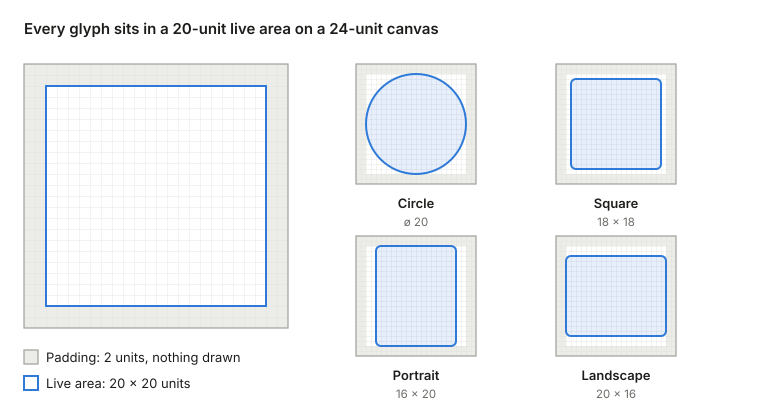

# TechKun Iconography Spec

As of 2026-10-03.

## Purpose and scope

Every icon on TechKun surfaces is drawn on one grid, with one stroke language, sized and aligned by one set of rules. This spec defines those rules; the `/iconography` module implements them.

| Category | Examples | Covered by |
| --- | --- | --- |
| UI glyphs | arrow, mail, close, external | All standards |
| Brand marks | TechKun, X, LinkedIn | Sizing, alignment, color, accessibility, naming; exempt from stroke and grid snapping |
| Animated glyphs | a mail → send morph, a ringing bell, a spinner | All standards + Motion |
| Illustrations | section illustrations and decorative graphics | Out of scope |

## Grid and keylines

Every glyph is drawn on a `0 0 24 24` canvas, inside a 20-unit live area centered by 2 units of padding on each side.

- **Canvas:** 24 × 24 units. The `viewBox` is always `0 0 24 24`; never cropped or offset.
- **Padding:** 2 units on all sides. Padding and keylines are measured at the stroke's centerline: a stroke may extend into the padding by half its width (at most 1.125 units, at the xl stroke step).
- **Live area:** 20 × 20 units, from (2, 2) to (22, 22).
- **Coordinates:** every point and control point lands on a whole or half unit (e.g. 7, 7.5). Curve control points may break this only where a whole/half value visibly distorts the curve.
- **Keylines:** the base shape a glyph is built on, so glyphs of different shapes carry the same visual weight.

| Keyline | Size (units) | Use for |
| --- | --- | --- |
| Circle | ø 20 | Round objects: clock, globe, avatar |
| Square | 18 × 18 | Boxy objects: window, calendar, card |
| Portrait | 16 w × 20 h | Tall objects: phone, document, bottle |
| Landscape | 20 w × 16 h | Wide objects: mail, laptop, image |

A square looks larger than a circle of the same width, so it is drawn smaller; that is why the keylines differ.



## Stroke and form

UI glyphs are outlines: one stroke weight, round ends, round corners, no fills except small solid details.

- **Stroke weight:** one weight per glyph, set by the icon's `stroke` prop or by the host (see [Sizing](#sizing)); never by the glyph itself. Glyph data carries no `stroke-width`.
- **Caps and joins:** `round` caps, `round` joins, everywhere.
- **Corner radius:** 2 units on the corners of rectangular forms. Smaller rectangles (under 6 units a side) use 1 unit.
- **Gaps:** where two strokes nearly touch or one passes behind another, leave a gap of at least 2 units so they don't merge at small sizes.
- **Fills:** allowed only for solid details under 3 units across (a dot, a notification badge). Everything else is stroke.
- **Filled icons:** a filled version of a glyph is a separate icon with its own name (see [Naming](#naming)), drawn to the same grid and keylines. It is never generated by filling an outline.

## Sizing

Icons are sized one of two ways: on a fixed four-step scale for standalone icons, or in text units for icons that sit in a line of text. Stroke is set separately, on its own scale, at any size.

### Fixed scale

| Step | Size (px) |
| --- | --- |
| sm | 16 |
| md | 20 |
| lg | 24 |
| xl | 32 |

### Stroke scale

Independent of the size scale: any stroke step works with any size.

| Step | Stroke (grid units) |
| --- | --- |
| sm | 1.5 |
| md | 1.75 |
| lg | 2 |
| xl | 2.25 |

Stroke is stored in grid units, because `stroke-width` on a `0 0 24 24` canvas is measured in those units, so it scales with the icon's size. On screen:

```
stroke (px) = stroke (grid units) × size (px) / 24
```

- **Default:** 2 grid units when neither the icon nor a host sets a stroke. At `1em` in 16px text that is about 1.33px on screen.
- **Host stroke:** a host may set `--icon-stroke` (in grid units) to match the weight of its text, e.g. a bold button label. It reaches every icon inside it that has no `stroke` prop.
- **Stroke prop:** an icon's `stroke` prop overrides the host: a stroke step (`stroke="sm"`) or a width in grid units (`stroke={1.5}`).

### Text-relative

- **Size:** set freely per usage in text units: `1em`, `1.2em`, `1cap`, `1lh`. The system doesn't standardize it.
- **Alignment:** one of the named modes in the next section. This is the part the system standardizes.

## Alignment with text

An inline icon uses one of three alignment modes; each is a fixed formula that works at any icon size.

| Mode | Where the icon sits | `vertical-align` | Use when |
| --- | --- | --- | --- |
| cap-center | Its center at half the capital-letter height | `calc((1cap - var(--icon-size)) / 2)` | Default. Text that starts with capitals or mixes cases |
| x-center | Its center at half the lowercase-letter height | `calc((1ex - var(--icon-size)) / 2)` | All-lowercase text |
| baseline | Its bottom on the text baseline | `baseline` | The icon stands in for a letter or sits on a rule |

Why the formula works: an inline `<svg>` sits with its bottom edge on the baseline. Raising it by half the letter height, minus half its own size, puts its center at the middle of the letters.

- The icon always sets `--icon-size` (default `1em`), so the formula has a size to read in both sizing modes.
- `cap-center` is `-(size / 2 - 0.5cap)`.
- Gap between icon and text is spacing, not alignment: set it on the parent with the spacing tokens, not on the icon.

## Color

Icons take their color from the text around them (`currentColor`); a glyph may also paint with the shared gradient.

- **Default:** stroke (or fill, for filled icons and brand marks) is `currentColor`. To recolor an icon, set `color` on it or its parent.
- **No literal paint on visible elements:** a glyph paints only with `currentColor`, `var(--icon-paint)` or a gradient or pattern it defines itself. Mask content is exempt: its black and white are transparency, not color.
- **Shared gradient:** a glyph that needs `<SVGBrandGradient>` renders it in its own `<defs>` with a scoped id. Its stops read two custom properties local to it; both default to `currentColor`, so the gradient is invisible until an element with the `SVGBrandGradient.host` class is hovered or focused, which sets them to `--color-brand-1` / `--color-brand-3`. The stops transition `stop-color` themselves, since the unregistered properties can't interpolate.
- **Painting with it:** either reference it on an element (`stroke={url("paint")}`), or set `--icon-paint` to it in the glyph's styles function, which repaints everything that uses the default paint.
- **Transitions:** color changes animate the custom properties, as the links do today, with timing from the motion tokens.

## Accessibility

An icon is either decorative and hidden from assistive technology, or meaningful and labelled; there is no third state.

| Case | Example | Markup |
| --- | --- | --- |
| Decorative: visible text says the same thing | Mail icon next to "Email us" | `aria-hidden="true"` on the `<svg>` |
| Icon-only control | Mail icon alone inside a link | `aria-hidden="true"` on the `<svg>`; `aria-label` on the link or button |
| Meaningful on its own, not interactive | Status icon in a table cell | `role="img"` + `aria-label` on the `<svg>` |

- Decorative is the default: an icon with no label is hidden.
- Labels describe the action or meaning ("Email us at hello@…"), not the picture ("envelope").
- `title` tooltips are never the only label.
- Every `<svg>` sets `focusable="false"`; focus belongs to the control around it.
- Animations respect `prefers-reduced-motion` (see [Motion](#motion)).

## Naming

A glyph is named for what it shows, as `object` or `object-modifier`, in kebab-case.

| Pattern | Examples | Rule |
| --- | --- | --- |
| `object` | `mail`, `clock`, `globe` | The thing drawn, singular noun |
| `object-modifier` | `mail-open`, `arrow-up-right`, `chevron-down` | Modifier = a state, direction or variant of the object |
| `object-filled` | `mail-filled`, `heart-filled` | The filled version of an outline icon; `filled` is a reserved modifier |
| `logo-name` | `logo-x`, `logo-linkedin`, `logo-techkun` | Brand marks |

- Names describe the picture, not its use: `mail`, not `contact`; `arrow-right`, not `next`.
- Directions are written from the viewer's side: `up`, `down`, `left`, `right`, combined vertical first (`up-right`).
- Names are unique across the whole set, outline, filled and brand included.

## Motion

The system standardizes how an animation is triggered and what happens under reduced motion; how a glyph animates is up to the glyph.

### Kinds and triggers

| Kind | Example | Trigger |
| --- | --- | --- |
| State transition | menu → close, mail → send | `state` prop, or the host trigger |
| Interaction response | bell rings on hover | Host trigger |
| One-shot | check mark draws itself in | Mount trigger, or a `state` change |
| Loop | spinner, pulse | None: runs while mounted |
| Progress-driven | a ring filling with a value | `progress` prop (0–1) |

- **States:** a glyph declares its states; the first is the initial one. The icon component puts the current state on the `<svg>` as `data-state`.
- **`state` prop:** controlled from JS, typed to the glyph's states. It overrides the mount trigger.
- **Host trigger:** the glyph names the state it takes while its host is hovered or focused (`:focus-visible`). The host is wired up through the glyph's host bindings (below).
- **Host bindings:** the glyph maps keys to binders, functions that receive its `name`, `kind`, `states` and `triggers` and generate what one kind of host needs. Each result is set on the component under its key, and the host spreads it:
    - `cssHost` → `Bell.host`: the `icon-host` class, to add to the host's own `className`. Pure CSS, so the host needs no JS.
    - `motionHost` → `Bell.motionHost`: `{initial, whileHover, whileFocus, whileTap}`, variant labels named after the glyph's states, for a `motion` host to spread.
    - Any other binder a glyph needs, e.g. for another animation library. Keys that would overwrite the component's own properties (`name`, `displayName`, …) fail type-checking.
- **Mount trigger:** the glyph names the state it switches to on the first frame after mount, so a transition runs from the initial state.
- **Progress:** the icon component sets `--icon-progress` on the `<svg>`, so glyph CSS can drive e.g. `stroke-dashoffset` with no JS per frame; the value is also in the render context.
- **Selecting a state in glyph CSS:** `inState("ringing")`, from the render context, matches both `data-state` and the host trigger. It is typed to the glyph's states.

### Techniques

Any technique a glyph needs: CSS transitions and keyframes, SMIL, `motion`, `d` morphs, `stroke-dashoffset` draw-ons, animated masks.

- **Timing:** easing comes from the motion tokens. Duration is set per glyph, since there are no duration tokens.
- **`d` morphs:** every state has the same number of path commands, of the same types in the same order, and the same number of subpaths. Case (absolute vs relative) may differ: `M c l …` and `M C L …` match. Where CSS `d` transitions aren't supported, the morph runs through `motion`.
- **Grid still applies:** every state follows the Grid and Stroke rules on its own.
- **`motion` and the host trigger:** CSS hover can't drive `motion`, so a `motion`-animated glyph gets the host trigger only from a `motion` host spreading its `motionHost` binding, whose variant labels pass down.

### Reduced motion

- Under `prefers-reduced-motion: reduce`, `icons.css` turns off CSS animations and transitions inside `.icon`: loops stop and state changes land on their end state immediately.
- A glyph's resting styles per state must show that state fully without the animation.
- SMIL and `motion` animations are not covered by that rule; a glyph using them checks reduced motion itself (e.g. `motion`'s `useReducedMotion`).

## Brand marks

Brand marks keep their official shapes, so they skip the drawing rules but follow every rule about how an icon is placed and used.

| Standard | Applies to brand marks? | Note |
| --- | --- | --- |
| Canvas and padding | Yes | Fitted into the 20-unit live area of the 24 canvas, centered |
| Keylines | No | The mark's own proportions win |
| Coordinate snapping | No | Official geometry is kept as is |
| Stroke and form | No | Usually filled |
| Sizing and alignment | Yes | Same scale and modes as UI glyphs |
| Color | Yes | `currentColor` or `<SVGBrandGradient>`; no hard-coded brand colors |
| Accessibility, naming | Yes | `logo-` prefix |

- Marks that repeat on a page (TechKun, X, LinkedIn today) are delivered through the sprite in `SVGSprite.tsx`, referenced with `<use>`.
- The full TechKun logo lockup is a logo, not an icon, and stays outside this system.

## Implementation

The system lives in a top-level `/iconography` module: one `createIcon` factory that turns each glyph into a component rendering it in a fixed frame, and one CSS file for size, stroke, alignment and reduced motion.

```
iconography/
  glyph.ts         the glyph contract: types only
  create-icon.tsx  createIcon(glyph) → icon component; iconHost
  host-bindings.ts the shared binders: cssHost, motionHost
  gradients/       shared gradients, for use inside a glyph's <defs>: SVGBrandGradient
  glyphs/          one file per glyph, each exporting its icon component
  icons.css        tokens, .icon base, size and stroke steps, alignment modes
  SVGSprite.tsx    the sprite for marks that repeat on a page, referenced with <use>
```

### Glyphs

The frame, rendered by every component `createIcon` returns, owns the `<svg viewBox="0 0 24 24">`, size, stroke defaults, color, alignment and accessibility. A glyph owns what is drawn inside it, and may use any SVG element: shapes, `g`, `use`, `defs`, `mask`, `clipPath`, gradients, patterns, filters, SMIL, `motion` elements.

```tsx
// iconography/glyphs/bell.tsx
"use client"
export default createIcon({
    name: "bell",
    kind: "outline",
    states: ["idle", "ringing"],
    triggers: {host: "ringing"},
    hostBindings: {host: cssHost, motionHost},
    styles: ({inState}) => css`
        .bell-swing { transform-origin: 12px 4.5px; }
        ${inState("ringing")} {
            .bell-swing { animation: ${ring} 0.6s var(--ease-out-cubic); }
        }
    `,
    render: ({id, url}) => <>
        <defs>
            <mask id={id("clapper-gap")}>…</mask>
        </defs>
        <g className="bell-swing">
            <path mask={url("clapper-gap")} d="…" />
            <circle cx="12" cy="19.5" r="1.5" fill="currentColor" />
        </g>
    </>
});
```

| Field | Holds |
| --- | --- |
| `name` | The glyph's name, per [Naming](#naming); also the component's `displayName` |
| `kind` | `outline` \| `filled` \| `brand`; non-outline glyphs get `.icon-solid` |
| `states` | Optional; the first is the initial state |
| `triggers` | Optional `host` and `mount` states; type-checked against `states` |
| `styles` | Optional emotion styles applied to the `<svg>`, or a function building them from the render context |
| `render` | Rendered as a component inside the frame, so it may use hooks |
| `hostBindings` | Optional map of binders; see [Motion](#motion) |

- **Render context:** `id(local)` scopes a `<defs>` id to the rendered icon, so two icons on a page never share a mask; `url(local)` is its `url(#…)`; `inState(state)` is the state selector (see [Motion](#motion)); plus `state` and `progress`.
- **Stroke and fill:** shapes inherit stroke from `.icon`. A part that should be solid sets `fill="currentColor"` on itself.
- **No registry:** each glyph file exports its own component, imported directly. Its states are typed from the definition: `<Bell state="ring">` fails type-checking.
- **Client modules:** glyph files start with `"use client"`, because the component uses hooks and emotion's `css` prop.

```tsx
import Bell from "@/iconography/glyphs/bell";

<button className={Bell.host} aria-label="Notifications">
    <Bell size="md" />
</button>
<motion.button className={Bell.host} {...Bell.motionHost} aria-label="Notifications">
    <Bell size="md" />
</motion.button>
<Bell state="ringing" label="Unread notifications" />
```

### Icon component props

| Prop | Values | Default |
| --- | --- | --- |
| `size` | `sm` \| `md` \| `lg` \| `xl`, or a CSS length (`1.2em`) | `1em` |
| `stroke` | `sm` \| `md` \| `lg` \| `xl` (stroke scale), or a width in grid units (`1.5`) | A host's `--icon-stroke`, else 2 |
| `align` | `cap` \| `ex` \| `baseline` | `cap` for text-relative sizes; `baseline` for fixed steps |
| `label` | Text | None → decorative (`aria-hidden`) |
| `state` | One of the glyph's states | The mount trigger's state after mount, else the first state |
| `progress` | A number, 0–1 | None |

### CSS

Only the `<svg>` element's presentation lives in CSS, because `em` / `cap` / `lh` resolve only there, and custom properties let a parent size every icon inside it. Values are from [Sizing](#sizing).

The rules are in [`icons.css`](icons.css):

| Rule | Layer | Does |
| --- | --- | --- |
| `--icon-size-*`, `--icon-stroke-*` on `:root` | `base` | The size and stroke scale tokens |
| `.icon` | `components` | Size from `--icon-size` (default `1em`), stroke from `--icon-stroke` (default 2), round caps and joins, paint from `--icon-paint` (default `currentColor`; a glyph's styles can set it, e.g. to its gradient) |
| `.icon-solid` | `components` | Fill instead of stroke, for `filled` and `brand` glyphs |
| `.icon-size-sm` … `.icon-size-xl` | `components` | Set `--icon-size` to a step |
| `.icon-stroke-sm` … `.icon-stroke-xl` | `components` | Set `--icon-stroke` to a stroke step |
| `.icon-align-cap`, `.icon-align-ex` | `components` | The alignment formulas; baseline is the default and has no class |

A reduced-motion rule turns off CSS animations and transitions inside `.icon` (see [Motion](#motion)).

The icon component sets `--icon-size` inline for a CSS-length size, `--icon-stroke` inline for a literal stroke, and `--icon-progress` when `progress` is set. `icons.css` is imported once, globally.

### Delivery

- **UI and animated glyphs:** inline `<svg>`, rendered by each glyph's component, so glyphs can be styled and animated.
- **Repeating brand marks:** the sprite in `SVGSprite.tsx`, referenced with `<use>`.

## Open items

- [x] Size and stroke values in [Sizing](#sizing): confirmed.
- [x] The 2-unit corner radius in [Stroke and form](#stroke-and-form): confirmed.
- [x] The `-filled` suffix and `logo-` prefix in [Naming](#naming): confirmed.
- [x] `icons.css` lives in `iconography/`.
- [ ] Build check script: on hold, to revisit.
- [x] Glyphs are components, and animations have three triggers: `state` prop, host, mount.
- [x] Padding and keylines are measured at the stroke's centerline.
- [ ] Redraw `mail`'s paper-plane state on the grid: it is off the half-unit grid and reaches past the live area (x 22.2, y 1.8).
